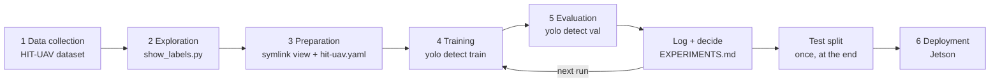

# ML workflow (Step 4)

How the HIT-UAV detector maps onto the standard ML workflow. GitHub and VS Code render the diagram below.

| Stage | In this repo | Status |
|---|---|---|
| 1 Data collection | HIT-UAV, already labeled by its authors | done |
| 2 Exploration | `show_labels.py` + shell counts (class balance, altitude) | done |
| 3 Preparation | `data/hit-uav-yolo` symlinks + `config/hit-uav.yaml` | done |
| 4 Training | fine-tune COCO `yolo11n.pt` → `runs/detect/<name>/weights/best.pt` | smoke, n640, n1280, s640 |
| 5 Evaluation | `yolo detect val` on the **val** split, results in `EXPERIMENTS.md` | done (n640 chosen) |
| Test split | evaluate the chosen model once on **test** | done: mAP50 0.886, Person R 0.890 |
| 6 Deployment | export + run on the Jetson | not done |

The loop 4 → 5 → decide → 4 is where most of the work happens: change one thing, retrain, compare.
